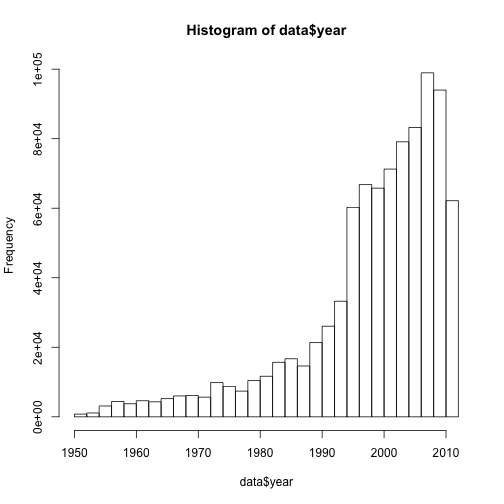
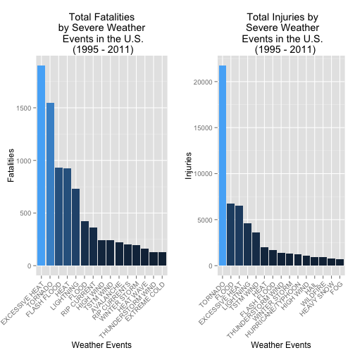
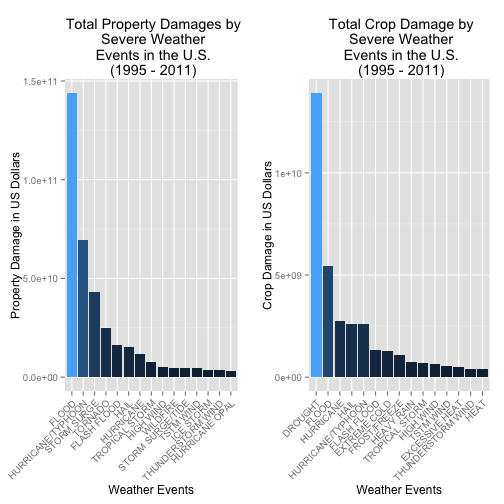

# Impact of Severe Weather Events on Population Health and Economy in US  

#Synonpsis

In this report, we aim to analyze the impact of different weather events on public health and economy based on the Storm database collected from the U.S. National Oceanic and Atmospheric Administrations's (NOAA) from 1950-2011. We will use the estimate of fatalities , injuries, property and crop damage to decide which types of events are most harmful to the population health and economy. From these data, we found that excessive heat and tornado are most harmful with respect to population health, while flood, drought and hurricance/typhoon have the greatest economic consequences. Interstingly, only flooding is one of the top three most dangerous or most costly event types.

#Basic Settings

```r
echo = TRUE #Always make code visible

packages <- c("plyr","ggplot2","gridExtra","R.utils")
sapply(packages,require,character.only=T,quietly=T)
```

```
## Warning in library(package, lib.loc = lib.loc, character.only = TRUE,
## logical.return = TRUE, : there is no package called 'R.utils'
```

```
##      plyr   ggplot2 gridExtra   R.utils 
##      TRUE      TRUE      TRUE     FALSE
```

#Downloading Data File

Download the [storm data file.](http://d396qusza40orc.cloudfront.net/repdata%2Fdata%2FStormData.csv.bz2)


```r
if(!file.exists("./data/stormData.csv")){
url <- "http://d396qusza40orc.cloudfront.net/repdata%2Fdata%2FStormData.csv.bz2";
download.file(url,destfile="./data/stormData.csv")
}
```

#Reading Data File 
we will read the data from the file.


```r
data <- read.csv("./data/stormData.csv")
```

#Analysing the data
Summary of the data


```r
summary(data)
```

```
##     STATE__                  BGN_DATE             BGN_TIME     
##  Min.   : 1.0   5/25/2011 0:00:00:  1202   12:00:00 AM: 10163  
##  1st Qu.:19.0   4/27/2011 0:00:00:  1193   06:00:00 PM:  7350  
##  Median :30.0   6/9/2011 0:00:00 :  1030   04:00:00 PM:  7261  
##  Mean   :31.2   5/30/2004 0:00:00:  1016   05:00:00 PM:  6891  
##  3rd Qu.:45.0   4/4/2011 0:00:00 :  1009   12:00:00 PM:  6703  
##  Max.   :95.0   4/2/2006 0:00:00 :   981   03:00:00 PM:  6700  
##                 (Other)          :895866   (Other)    :857229  
##    TIME_ZONE          COUNTY           COUNTYNAME         STATE       
##  CST    :547493   Min.   :  0.0   JEFFERSON :  7840   TX     : 83728  
##  EST    :245558   1st Qu.: 31.0   WASHINGTON:  7603   KS     : 53440  
##  MST    : 68390   Median : 75.0   JACKSON   :  6660   OK     : 46802  
##  PST    : 28302   Mean   :100.6   FRANKLIN  :  6256   MO     : 35648  
##  AST    :  6360   3rd Qu.:131.0   LINCOLN   :  5937   IA     : 31069  
##  HST    :  2563   Max.   :873.0   MADISON   :  5632   NE     : 30271  
##  (Other):  3631                   (Other)   :862369   (Other):621339  
##                EVTYPE         BGN_RANGE           BGN_AZI      
##  HAIL             :288661   Min.   :   0.000          :547332  
##  TSTM WIND        :219940   1st Qu.:   0.000   N      : 86752  
##  THUNDERSTORM WIND: 82563   Median :   0.000   W      : 38446  
##  TORNADO          : 60652   Mean   :   1.484   S      : 37558  
##  FLASH FLOOD      : 54277   3rd Qu.:   1.000   E      : 33178  
##  FLOOD            : 25326   Max.   :3749.000   NW     : 24041  
##  (Other)          :170878                      (Other):134990  
##          BGN_LOCATI                  END_DATE             END_TIME     
##               :287743                    :243411              :238978  
##  COUNTYWIDE   : 19680   4/27/2011 0:00:00:  1214   06:00:00 PM:  9802  
##  Countywide   :   993   5/25/2011 0:00:00:  1196   05:00:00 PM:  8314  
##  SPRINGFIELD  :   843   6/9/2011 0:00:00 :  1021   04:00:00 PM:  8104  
##  SOUTH PORTION:   810   4/4/2011 0:00:00 :  1007   12:00:00 PM:  7483  
##  NORTH PORTION:   784   5/30/2004 0:00:00:   998   11:59:00 PM:  7184  
##  (Other)      :591444   (Other)          :653450   (Other)    :622432  
##    COUNTY_END COUNTYENDN       END_RANGE           END_AZI      
##  Min.   :0    Mode:logical   Min.   :  0.0000          :724837  
##  1st Qu.:0    NA's:902297    1st Qu.:  0.0000   N      : 28082  
##  Median :0                   Median :  0.0000   S      : 22510  
##  Mean   :0                   Mean   :  0.9862   W      : 20119  
##  3rd Qu.:0                   3rd Qu.:  0.0000   E      : 20047  
##  Max.   :0                   Max.   :925.0000   NE     : 14606  
##                                                 (Other): 72096  
##            END_LOCATI         LENGTH              WIDTH         
##                 :499225   Min.   :   0.0000   Min.   :   0.000  
##  COUNTYWIDE     : 19731   1st Qu.:   0.0000   1st Qu.:   0.000  
##  SOUTH PORTION  :   833   Median :   0.0000   Median :   0.000  
##  NORTH PORTION  :   780   Mean   :   0.2301   Mean   :   7.503  
##  CENTRAL PORTION:   617   3rd Qu.:   0.0000   3rd Qu.:   0.000  
##  SPRINGFIELD    :   575   Max.   :2315.0000   Max.   :4400.000  
##  (Other)        :380536                                         
##        F               MAG            FATALITIES          INJURIES        
##  Min.   :0.0      Min.   :    0.0   Min.   :  0.0000   Min.   :   0.0000  
##  1st Qu.:0.0      1st Qu.:    0.0   1st Qu.:  0.0000   1st Qu.:   0.0000  
##  Median :1.0      Median :   50.0   Median :  0.0000   Median :   0.0000  
##  Mean   :0.9      Mean   :   46.9   Mean   :  0.0168   Mean   :   0.1557  
##  3rd Qu.:1.0      3rd Qu.:   75.0   3rd Qu.:  0.0000   3rd Qu.:   0.0000  
##  Max.   :5.0      Max.   :22000.0   Max.   :583.0000   Max.   :1700.0000  
##  NA's   :843563                                                           
##     PROPDMG          PROPDMGEXP        CROPDMG          CROPDMGEXP    
##  Min.   :   0.00          :465934   Min.   :  0.000          :618413  
##  1st Qu.:   0.00   K      :424665   1st Qu.:  0.000   K      :281832  
##  Median :   0.00   M      : 11330   Median :  0.000   M      :  1994  
##  Mean   :  12.06   0      :   216   Mean   :  1.527   k      :    21  
##  3rd Qu.:   0.50   B      :    40   3rd Qu.:  0.000   0      :    19  
##  Max.   :5000.00   5      :    28   Max.   :990.000   B      :     9  
##                    (Other):    84                     (Other):     9  
##       WFO                                       STATEOFFIC    
##         :142069                                      :248769  
##  OUN    : 17393   TEXAS, North                       : 12193  
##  JAN    : 13889   ARKANSAS, Central and North Central: 11738  
##  LWX    : 13174   IOWA, Central                      : 11345  
##  PHI    : 12551   KANSAS, Southwest                  : 11212  
##  TSA    : 12483   GEORGIA, North and Central         : 11120  
##  (Other):690738   (Other)                            :595920  
##                                                                                                                                                                                                     ZONENAMES     
##                                                                                                                                                                                                          :594029  
##                                                                                                                                                                                                          :205988  
##  GREATER RENO / CARSON CITY / M - GREATER RENO / CARSON CITY / M                                                                                                                                         :   639  
##  GREATER LAKE TAHOE AREA - GREATER LAKE TAHOE AREA                                                                                                                                                       :   592  
##  JEFFERSON - JEFFERSON                                                                                                                                                                                   :   303  
##  MADISON - MADISON                                                                                                                                                                                       :   302  
##  (Other)                                                                                                                                                                                                 :100444  
##     LATITUDE      LONGITUDE        LATITUDE_E     LONGITUDE_    
##  Min.   :   0   Min.   :-14451   Min.   :   0   Min.   :-14455  
##  1st Qu.:2802   1st Qu.:  7247   1st Qu.:   0   1st Qu.:     0  
##  Median :3540   Median :  8707   Median :   0   Median :     0  
##  Mean   :2875   Mean   :  6940   Mean   :1452   Mean   :  3509  
##  3rd Qu.:4019   3rd Qu.:  9605   3rd Qu.:3549   3rd Qu.:  8735  
##  Max.   :9706   Max.   : 17124   Max.   :9706   Max.   :106220  
##  NA's   :47                      NA's   :40                     
##                                            REMARKS           REFNUM      
##                                                :287433   Min.   :     1  
##                                                : 24013   1st Qu.:225575  
##  Trees down.\n                                 :  1110   Median :451149  
##  Several trees were blown down.\n              :   568   Mean   :451149  
##  Trees were downed.\n                          :   446   3rd Qu.:676723  
##  Large trees and power lines were blown down.\n:   432   Max.   :902297  
##  (Other)                                       :588295
```


```r
head(data,2)
```

```
##   STATE__          BGN_DATE BGN_TIME TIME_ZONE COUNTY COUNTYNAME STATE
## 1       1 4/18/1950 0:00:00     0130       CST     97     MOBILE    AL
## 2       1 4/18/1950 0:00:00     0145       CST      3    BALDWIN    AL
##    EVTYPE BGN_RANGE BGN_AZI BGN_LOCATI END_DATE END_TIME COUNTY_END
## 1 TORNADO         0                                               0
## 2 TORNADO         0                                               0
##   COUNTYENDN END_RANGE END_AZI END_LOCATI LENGTH WIDTH F MAG FATALITIES
## 1         NA         0                        14   100 3   0          0
## 2         NA         0                         2   150 2   0          0
##   INJURIES PROPDMG PROPDMGEXP CROPDMG CROPDMGEXP WFO STATEOFFIC ZONENAMES
## 1       15    25.0          K       0                                    
## 2        0     2.5          K       0                                    
##   LATITUDE LONGITUDE LATITUDE_E LONGITUDE_ REMARKS REFNUM
## 1     3040      8812       3051       8806              1
## 2     3042      8755          0          0              2
```

#Cleaning up the data

There are 902297 rows and 37 columns in total. The events in the database start in the year 1950 and end in November 2011. In the earlier years of the database there are generally fewer events recorded, most likely due to a lack of good records. More recent years should be considered more complete.


```r
if(dim(data)[2] == 37){
        data$year = as.numeric(format(as.Date(data$BGN_DATE, format = "%m/%d/%Y %H:%M:%S"), "%Y"))
}
hist(data$year,breaks = 40)
```

 

So based on above histogram, we can say that number of events tracked starts to significantly increase around 1950 . So we will subset the data for 1950 to 2011 to get most out of good records.


```r
data <- data[data$year >= 1995,]
dim(data)
```

```
## [1] 681500     38
```
Now there are 681500 rows and 38 columns.


```r
##We have to change PROPDMGEXP & CROPDMGEXP to USD
convertHelper <- function(dataset = storm, fieldName, newFieldName) {
    totalLen <- dim(dataset)[2]
    index <- which(colnames(dataset) == fieldName)
    dataset[, index] <- as.character(dataset[, index])
    logic <- !is.na(toupper(dataset[, index]))
    dataset[logic & toupper(dataset[, index]) == "B", index] <- "9"
    dataset[logic & toupper(dataset[, index]) == "M", index] <- "6"
    dataset[logic & toupper(dataset[, index]) == "K", index] <- "3"
    dataset[logic & toupper(dataset[, index]) == "H", index] <- "2"
    dataset[logic & toupper(dataset[, index]) == "", index] <- "0"
    dataset[, index] <- as.numeric(dataset[, index])
    dataset[is.na(dataset[, index]), index] <- 0
    dataset <- cbind(dataset, dataset[, index - 1] * 10^dataset[, index])
    names(dataset)[totalLen + 1] <- newFieldName
    return(dataset)
}
```


```r
##Sorting helper to sort 
sortHelper <- function(fieldName, top = 15, data=data) {
    index <- which(colnames(data) == fieldName)
    field <- aggregate(data[, index], by = list(data$EVTYPE), FUN = "sum")
    names(field) <- c("EVTYPE", fieldName)
    field <- arrange(field, field[, 2], decreasing = T)
    field <- head(field, n = top)
    field <- within(field, EVTYPE <- factor(x = EVTYPE, levels = field$EVTYPE))
    return(field)
}
```

#Impact on Public Health
Here we check the number of ***fatalities*** and ***injuires*** that are caused by the severe weather event, we are getting the top 15 most severe type of weather events.

```r
fatalitiesByEvent <- sortHelper("FATALITIES",data=data)
injuriesByEvent <- sortHelper("INJURIES",data=data)
```

#Impact on Economy
Here we will convert the **property damage** and **crop damage** data into comparable numerical forms according to the units decribed in [ Storm Events](http://ire.org/nicar/database-library/databases/storm-events/). Both PROPDMGEXP and CROPDMGEXP columns record a multiplier for each observation where we have Hundred (H), Thousand (K), Million (M) and Billion (B).

```r
data <- convertHelper(data,"PROPDMGEXP","PropertyDamage")
```

```
## Warning in convertHelper(data, "PROPDMGEXP", "PropertyDamage"): NAs
## introduced by coercion
```

```r
data <- convertHelper(data,"CROPDMGEXP","CropDamage")
```

```
## Warning in convertHelper(data, "CROPDMGEXP", "CropDamage"): NAs introduced
## by coercion
```

```r
names(data)
```

```
##  [1] "STATE__"        "BGN_DATE"       "BGN_TIME"       "TIME_ZONE"     
##  [5] "COUNTY"         "COUNTYNAME"     "STATE"          "EVTYPE"        
##  [9] "BGN_RANGE"      "BGN_AZI"        "BGN_LOCATI"     "END_DATE"      
## [13] "END_TIME"       "COUNTY_END"     "COUNTYENDN"     "END_RANGE"     
## [17] "END_AZI"        "END_LOCATI"     "LENGTH"         "WIDTH"         
## [21] "F"              "MAG"            "FATALITIES"     "INJURIES"      
## [25] "PROPDMG"        "PROPDMGEXP"     "CROPDMG"        "CROPDMGEXP"    
## [29] "WFO"            "STATEOFFIC"     "ZONENAMES"      "LATITUDE"      
## [33] "LONGITUDE"      "LATITUDE_E"     "LONGITUDE_"     "REMARKS"       
## [37] "REFNUM"         "year"           "PropertyDamage" "CropDamage"
```

```r
propertyEvents <- sortHelper("PropertyDamage",data=data)
cropEvents <- sortHelper("CropDamage",data=data)
```

##Results for Impact on Health
As for the impact on health , we got two sorted lists of severe weather events by which number of peoples are affected


```r
fatalitiesByEvent
```

```
##               EVTYPE FATALITIES
## 1     EXCESSIVE HEAT       1903
## 2            TORNADO       1545
## 3        FLASH FLOOD        934
## 4               HEAT        924
## 5          LIGHTNING        729
## 6              FLOOD        423
## 7        RIP CURRENT        360
## 8          HIGH WIND        241
## 9          TSTM WIND        241
## 10         AVALANCHE        223
## 11      RIP CURRENTS        204
## 12      WINTER STORM        195
## 13         HEAT WAVE        161
## 14 THUNDERSTORM WIND        131
## 15      EXTREME COLD        126
```

```r
injuriesByEvent
```

```
##               EVTYPE INJURIES
## 1            TORNADO    21765
## 2              FLOOD     6769
## 3     EXCESSIVE HEAT     6525
## 4          LIGHTNING     4631
## 5          TSTM WIND     3630
## 6               HEAT     2030
## 7        FLASH FLOOD     1734
## 8  THUNDERSTORM WIND     1426
## 9       WINTER STORM     1298
## 10 HURRICANE/TYPHOON     1275
## 11         HIGH WIND     1093
## 12              HAIL      916
## 13          WILDFIRE      911
## 14        HEAVY SNOW      751
## 15               FOG      718
```

Following is the pair of graphs showing total fatalities and total injuries affected by these severe weather events.


```r
fatalilitiesGraph <-ggplot(data = fatalitiesByEvent, aes(EVTYPE, FATALITIES, fill = FATALITIES)) + geom_bar(stat = "identity") +
    xlab("Weather Events") + ylab("Fatalities") + ggtitle(" Total Fatalities \nby Severe Weather\n Events in the U.S.\n (1995 - 2011)")  + theme(legend.position = "none",axis.text.x = element_text(angle = 45, hjust = 1))

injuriesGraphy <-ggplot(data = injuriesByEvent, aes(EVTYPE, INJURIES, fill = INJURIES)) + geom_bar(stat = "identity") +
    xlab("Weather Events") + ylab("Injuries") + ggtitle(" Total Injuries by\n Severe Weather\n Events in the U.S.\n   (1995 - 2011)")  + theme(legend.position = "none",axis.text.x = element_text(angle = 45, hjust = 1))
grid.arrange(fatalilitiesGraph,injuriesGraphy,ncol=2)
```

 

Based on above two graphs we can find that **excessive heat** and **tornado** cause most fatalities; **tornado** cause more injuries in US during 1950-2011.


##Results for Impact on Economy
As for the impact on Economy , we got two sorted lists of amount of money cost  by damages.


```r
propertyEvents
```

```
##               EVTYPE PropertyDamage
## 1              FLOOD   144022037057
## 2  HURRICANE/TYPHOON    69305840000
## 3        STORM SURGE    43193536000
## 4            TORNADO    24935939545
## 5        FLASH FLOOD    16047794571
## 6               HAIL    15048722103
## 7          HURRICANE    11812819010
## 8     TROPICAL STORM     7653335550
## 9          HIGH WIND     5259785375
## 10          WILDFIRE     4759064000
## 11  STORM SURGE/TIDE     4641188000
## 12         TSTM WIND     4482361440
## 13         ICE STORM     3643555810
## 14 THUNDERSTORM WIND     3399282992
## 15    HURRICANE OPAL     3172846000
```


```r
cropEvents
```

```
##               EVTYPE  CropDamage
## 1            DROUGHT 13922066000
## 2              FLOOD  5422810400
## 3          HURRICANE  2741410000
## 4               HAIL  2614127070
## 5  HURRICANE/TYPHOON  2607872800
## 6        FLASH FLOOD  1343915000
## 7       EXTREME COLD  1292473000
## 8       FROST/FREEZE  1094086000
## 9         HEAVY RAIN   728399800
## 10    TROPICAL STORM   677836000
## 11         HIGH WIND   633561300
## 12         TSTM WIND   553947350
## 13    EXCESSIVE HEAT   492402000
## 14 THUNDERSTORM WIND   414354000
## 15              HEAT   401411500
```
Following is the pair of graphs showing total property damage and total crops damage affected by these severe weather events.


```r
propertyGraph <-ggplot(data = propertyEvents, aes(EVTYPE, PropertyDamage, fill = PropertyDamage)) + geom_bar(stat = "identity") +
    xlab("Weather Events") + ylab("Property Damage in US Dollars") + ggtitle(" Total Property Damages by\n Severe Weather\n Events in the U.S.\n (1995 - 2011)")  + theme(legend.position = "none",axis.text.x = element_text(angle = 45, hjust = 1))

cropGraph <-ggplot(data = cropEvents, aes(EVTYPE, CropDamage, fill = CropDamage)) + geom_bar(stat = "identity") +
    xlab("Weather Events") + ylab("Crop Damage in US Dollars") + ggtitle(" Total Crop Damage by\n Severe Weather\n Events in the U.S.\n (1995 - 2011)")  + theme(legend.position = "none",axis.text.x = element_text(angle = 45, hjust = 1))
grid.arrange(propertyGraph,cropGraph,ncol=2)
```

 
Based on above two graphs we can find that **flood** and **hurricane/typhoon** cause most property damage; **drought** and **flood** cause more crop damages in US during 1950-2011.


#Conclusion
From the above data and graphs , we found that **excessive heat** and **tornado** are most harmful for public health, while **flood**, **drought** and **hurricane/typhoon** have greatest economic consequences.
